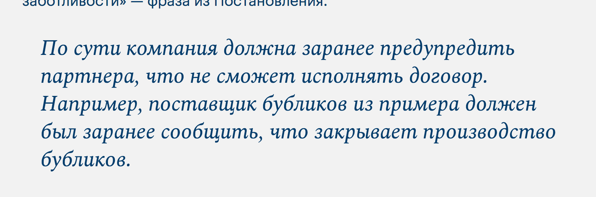
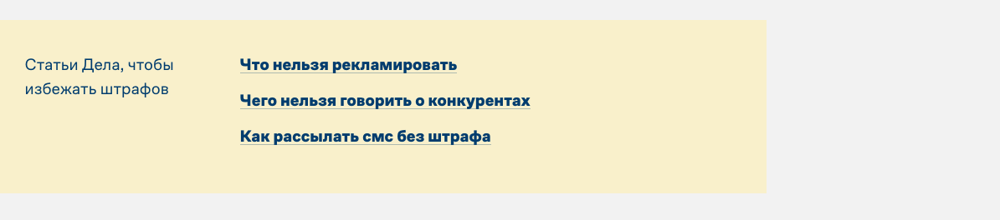
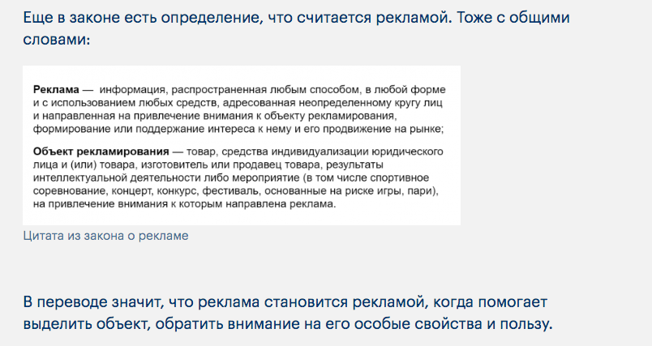
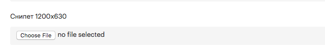
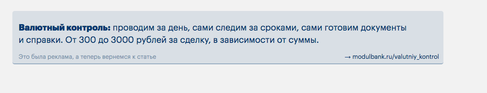

- [Оформление функциональных блоков](#оформление-функциональных-блоков)
- [Ссылки](#ссылки)
- [Абстрактные стили оформления](#абстрактные-стили-оформления)
- [«Короче»](#короче)
- [Настройка фона публикации](#настройка-фона-публикации)
- [Запретить перенос строки](#Запретить-перенос-строки)
- [Оформление иллюстраций и видео](#Оформление-иллюстраций)
- [Пустой формат](#Пустой-формат)
- [Тесты-Квизы](#Тесты-Квизы)
  - Тест «Какой ты…»
  - Тест «Насколько ты…»
- [Виджеты](#Виджеты)
  - [Блок с рекламой](#Блок-с-рекламой)
  - [Голосовалка](#Голосовалка)
  - [Банковская форма](#Банковская-форма)
  - [Ползунок](#Ползунок)
- [Комментарии](#Комментарии)
- [Шаринг](#Шаринг)


## Оформление функциональных блоков

### Заголовки

```jade
h2 О чем говорит ограничение ответственности

p Если партнер настаивает на ограничении ответственности в договоре, для компании это может быть сигналом. Например, она заключает с поставщиком договор на миллион, а он настаивает на ответственности в десять тысяч рублей. Возможно, стоит проверить отзывы об этом поставщике. Вдруг он часто срывает сроки или резко прекращает сотрудничество.

h3 Какие исключения

p Компания может ограничить свою ответственность, если работает по агентскому или инвестиционному договору. Это те случаи, когда компания не сама оказывает услуги или поставляет товары, а зависит от других компаний
```


В качестве альтернативы h2 можно использовать h6, они выглядят одинаково, но h6 не идёт в скролл-навигацию (которая в правом углу). Это когда заголовков слишком много.

### Пример

```jade
p.example Кофейня «Бублик» заключает договор с хлебозаводом на поставку круассанов на 2 млн в год. Ограничение ответственности по договору — 10 000 рублей.
```


### Цитата

```jade
p.cite По сути компания должна заранее предупредить партнера, что не сможет исполнять договор. Например, поставщик бубликов из примера должен был заранее сообщить, что закрывает производство бубликов.
```



### Слова читателя

```jade
p Александр Хорошев

.speech-bubble
  p Зависит от ситуации. Вообще, у нас не принято не повышать зарплату, не просить о ее повышении. Что странно, ведь квалификация работников растет. Если разница небольшая, может дело в том, что сотруднику тупо не хватает денег. Можно оговорить рост з/п, в сочетании с повышением ответственности. Если денег предлагают ощутимо больше, ну значит, сотрудник перерос вашу конторку. Селяви, это частое явление. Растите быстрее.
  p А бывает еще так, что предложили больше — и слава богу. Потому что с определенным работником бывает так, что и платить больше ты ему не можешь (может, не нарабатывает он, или, может, работа именно у тебя не дает ему возможности раскрыться), и уволить жалко. Тогда такая ситуация только на руку работодателю.
```


## Ссылки

### Царская ссылка на свою статью

```jade
.banner-image
  [IMG name="Mb_detskiy-center-inst-4.png"]
a.banner.self-link.orange(href="/all/assessment")
  .caption Читать в «Деле»
  h6 Как проходить спецоценку труда
```


Некадрированные картинки из статей без фона лежат [в яндекс диске](https://yadi.sk/d/Jc5BcbG0IDFIgg)

Картинку для царской ссылки предварительно надо подготовить в пропорциях 3:2. Файл с заготовкой для кадрирования: 

[self-link-images.psd](templates/self-link-images.psd)

Кадрированные картинки [в яндекс диске](https://yadi.sk/d/4pnhEEsIVZ8wXw) (можно сразу брать для вёрстки)

Фон берем с обложки статьи, на которую ссылаемся. Тег после `a.banner.self-link`  (в примере выше — `.orange`) заменяет цвет фона:


### Ссылка в тексте

```jade
p #[a(href='https://www.nalog.ru/rn77/') О налоге на имущество организаций] 
// важно, чтобы после скобки был пробел ↑
на сайте ФНС
```

```jade
p <a href='https://www.nalog.ru/rn77/'>О налоге на имущество организаций</a> на сайте ФНС
```

со счетчиками:

```jade
p <a href='https://www.nalog.ru/rn77/' data-goal-click="article-all-1">О налоге на имущество организаций</a> на сайте ФНС
```

### Ссылка на свою статью в тексте

```jade
Мы написали об этом #[a(href='/all/open/') инструкцию].
//   важно, чтобы после скобки был пробел ↑
```

```jade
Мы написали об этом <a href='/all/open/'>инструкцию</a>.
```

Ссылка на статью должна быть *локальной* (то есть, убираем из ссылки `https://delo.modulbank.ru`)


### Ссылка-кнопка

```jade
p
  a.button-link(href='http://kad.arbitr.ru/Card/0d222f42-991e-4636-9997-6eab45d06d82') Судебное дело
```


## Абстрактные стили оформления

Это когда стиль описывает визуальное оформление, а не функцию. Как его применять, решает автор

### Сноска

Ставится *перед* блоком, с которым должна выравниваться по вертикали

```jade
p.note Возмещение убытков — в статье 15 Гражданского кодекса

p Под убытками тут понимают реальный ущерб и упущенную выгоду. Реальный ущерб возникает, когда повредили или потеряли имущество. Упущенная выгода — доходы, которые компания могла бы получить, если бы обе стороны исполнили обязательства. Могла получить, но не получила.
```


### Сноска с несколькими предложениями

Ставится *перед* блоком, с которым должна выравниваться по вертикали

```jade
.note
  p <strong> Налоговая выгода — уменьшение налогов:</strong> вычеты, налоговые каникулы, уменьшение доходов на расходы на упрощенке.
  p <strong> Необоснованная налоговая выгода</strong> — незаконное уменьшение налогов: фиктивные расходы, работа с фирмами-однодневками.
```


### Цифра и подпись

Ставится *перед* блоком, с которым должна выравниваться по вертикали

```jade
.note
  .figure 500 рублей
  .caption в час стоило первое помещение школы танцев Анастасии
```


### Несколько ссылок в одной сноске

Ставится *перед* блоком, с которым должна выравниваться по вертикали

```jade
.note
  p #[a(href='http://www.consultant.ru') Статья 346.45 Налогового кодекса об условиях действия патента]
  p #[a(href='https://.kontur.ru') Письмо Минфина о перерасчете стоимости патента от 24.02.2016]
  p #[a(href='https://normativ.kontur.ru/document?moduleId=1&documentId=275693') Письмо Минфина о перерасчете стоимости патента от 25.05.2016]
```


### Ссылка c фотографией в сноске

Ставится *перед* блоком, с которым должна выравниваться по вертикали

```jade
.note
  a(href="https://docs.google.com/document/d/1xfkKupBuUSpgbL2qKtPhpzAv7QZ8mpu4pPb_e96eY9w/edit")
    [IMG name="2429-2-1-411.png"]
    Акт осмотра от эксперта статьи
```


### Ссылка на свою статью с картинкой

Ставится *перед* блоком, с которым должна выравниваться по вертикали

```jade
a.note.self-link(href="/all/martenity-pay")
  [IMG name="1900-2-1.png"]
  p Как ИП получить декретные
```

Ссылка должна быть *локальной*


### Ссылка на свою статью без картинки

Ставится *перед* блоком, с которым должна выравниваться по вертикали

```jade
a.note.self-link(href="/all/dependent") 
  p Когда налоговая подозревает взаимозависимость в «Деле»
```

Ссылка должна быть *локальной*


### Ярлык «Шаг»

```jade
h2 
  span.step Шаг 1.
  span  Провести собрание участников
//     ↑ дополнительный пробел
```


Вместо «шага» можно поставить любое слово. Перед заголовком нужен дополнительный пробел, чтобы в содержании справа не слиплись слова: «Шаг 1Провести».

Если боковой навигации не видно, надо немного уменьшить масштаб страницы с помощью `Cmd -`

### Еще статьи

```jade
.plate
  .columns
    .narrow-column
      p Статьи «Дела», чтобы избежать штрафов
    .wide-column
      p #[a(href='/all/fas')<strong>Что нельзя рекламировать</strong>]
      p #[a(href='/all/govorit_o_konkurentah')<strong>Чего нельзя говорить о конкурентах</strong>]
      p #[a(href='/all/sms')<strong>Как рассылать смс без штрафа</strong>]
```



### Маркер

```
p Под убытками тут понимают реальный ущерб и упущенную выгоду. <span class="marker">Реальный ущерб возникает, когда повредили или потеряли имущество.</span> Упущенная выгода — доходы, которые компания могла бы получить, если бы обе стороны исполнили обязательства. Могла получить, но не получила.
```


### Плашка

```
.plate
  p В договоре с «Легионом» было ограничение ответственности. Но суд посчитал этот пункт ничтожным, и «Легиону» пришлось выплатить полный ущерб.
```


### Колонки (без выравнивания текста между колонками)

```
.columns
  .column
    h5 Подозрительно
    p Компании работают в одной сфере, но делят участки. Одна делает каркас мебели, другая — натягивает на каркас ткань.
    p Компании работают в одном здании. Всю аренду оплачивает одна из компаний.
  .column 
    h5 Внушает доверие
    p У каждой компании свой договор на аренду.
    p Компании работают в одной сфере, но с разными процессами. Одна — производит новую мебель, другая — ремонтирует старую.
```


### Таблица

Две колонки

```
.table
  .th
    .td
      h5 Что делает ЦРМ
    .td
      h5 Примеры
  .tr
    .td
      p Накапливает информацию о клиенте
    .td
      p Записывает имя клиента, день рождения, частоту обращений, что покупает и на какие суммы, почему отказывается.
      p Знает всё, что хотел и спрашивал клиент вчера и два года назад.
  .tr
    .td
      p Помогает с продажами
    .td
      p Собирает вопросы клиента из письма.
      p Напоминает сотрудникам о задаче: что сделать, кому, когда и для кого.
      p Напоминает клиенту об оплате.
      p Готовит форму оплаты, которую можно поставить на лендинг за минуту.
      p Показывает складские остатки.
```


Три колонки

```
.table.three-columns
  .th
    .td
      h5 Первая
    .td
      h5 Вторая
    .td
      h5 Третья
  .tr
    .td
      p Накапливает информацию о клиенте
    .td
      p Записывает имя клиента, день рождения, частоту обращений, что покупает и на какие суммы, почему отказывается.
    .td
      p Знает всё, что хотел и спрашивал клиент вчера и два года назад.

```

### Списки

Ненумерованный

```
p По закону ликвидация занимает четыре месяца. Если кратко, процедура такая:
ul
  li участники принимают решение о ликвидации и назначают ликвидационную комиссию;
  li составляют протокол собрания с решением о ликвидации и уведомление о ликвидации по форме Р15001;
  li в течение трех дней после решения сообщают в регистрирующую налоговую о ликвидации, отдают протокол и уведомление;
  li через пять дней налоговая выдает лист о том, что сделала запись в реестр юридических лиц, и компания начинает процесс ликвидации;
  li компания публикует запись о ликвидации в «Вестнике государственной регистрации»;
```


Нумерованный

```
ol
  li сумму инвестиций,
  li сроки траншей,
  li в каком виде будет оформлен транш — заем или уставной капитал.
  Если заем, то инвестору это удобно, а у бизнеса будет обязательство;
  li планы;
  li периодичность встреч и сферы ответственности.
```


Диалог:

```jade
.dialog
  p — Геннадий, я хочу платить аренду безналично. Как нам перейти на
  безналичный расчет?
  p — Хммм. Ну мне это неудобно.
  p — Понимаю. Но, к сожалению, мне теперь неудобно платить наличными.
```


## «Короче»

Добавляется в специальный "Саммари" раздел в конце редактора


```jade
h5 Короче
.columns
  .column
    h4 Кто может оформить вычет
    p ИП на ЕНВД или патентной системе. ООО оформить вычет не могут. ИП на ОСНО, УСН или ЕСХН тоже не смогут получить вычет
  .column
    h4 Какие документы подать для вычета
    p На патенте: заявление по форме Минфина или в произвольной форме.
    p На ЕНВД: декларацию по итогам квартала по рекомендованной налоговой форме. В декларацию вписать нужно вписать расходы на кассу и налог, уменьшенный на стоимость кассы.

h4.figure 18 000 ₽
p размер вычета за одну кассу.
```


### Саммари для интервью. Описание с заголовком

```jade
h5 Коротко
.columns
  .column
    p Бизнес
    h4 Сбор и сортировка пластиковых отходов
  .column
    p Территория
    h4 Москва
  .column
    p Год создания
    h4 2018
  .column
    p Расходы на запуск
    h4 8 млн рублей
```


### Заголовок (цифра) с описанием

в таких случаях `p` заменяем на `.caption`, чтобы отступ между заголовком и текстом был меньше

```jade
h5 Коротко
.columns
  .column
    h4 1000
    .caption пациентов в год
  .column
    h4 250
    .caption сотрудников
  .column
    h4 2
    .caption корпуса
  .column
    h4 100
    .caption мест для пациентов
  .column
    h4 40-300 тысяч рублей
    .caption зарплаты
```


## Настройка фона публикации


Чекбокс «Тёмная тема» инвертирует весь текст в белый вне серого блока и красит фон сайта в чёрный. 

Чёрный можно поменять на другой в поле «Цвет». Поле принимает цвет в hex-формате: `#2c372c`. 

Чтобы поставить картинку на фон, загрузите ее как обычно, а потом скопируйте в поле «Изображение» имя картинки (внутри кавычек):

```jade
[IMG name="elka.jpg"]
```


Если используете картинку, подбирайте цвет фона близким к цвету картинки, чтобы «заменить» ее, пока она грузится.


## Запретить перенос строки

чтобы части числа и рубли не отрывались друг от друга, заворачивайте в <nobr>, вот так:

```jade
Всего он украл на <nobr>200 000 рублей</nobr>
```

и тогда все части «слова» `200 000 рублей` будут целиком переносится на следующую строку


## Оформление иллюстраций


Чтобы вставить иллюстрацию в текст, можно нажать на иконку и выбрать файл, а можно просто перетащить его прямо в редактор. Появится такая строчка:

```jade
[IMG name="filename.png"]
```

Где стоит эта строчка, там изображение и появится. Если строчка потерялась, можно кликнуть в иконку загруженного файла, и она вставится снова.

### Картинка с подписью

```jade
.image
  [IMG name="2390-2-1-fajzulenovaimage3.png"]
  .caption Все преподаватели школы в новом помещении на Лубянке
```


### Картинки меньшей ширины (75%, 50%, 25%, 10%):

```jade
.image.reduced-width
  [IMG name="filename.png"]

.image.half-width
  [IMG name="filename.png"] 

.image.small-width
  [IMG name="filename.png"]

.image.icon-width
  [IMG name="filename.png"]
```

**Стандартная ширина (100%)**


**.image.reduced-width (75%)**



**.image.half-width (50%)**


**.image.small-width (25%)**


**.image.icon-width (10%)**


*у галереи и картинки есть мега ширина для больших картинок. занимает текстовую колонку и боковую колонку справа*
```
.image.full-width
```

### Картинки в две колонки

```jade
.image
  .columns
    .column
      [IMG name="7-survilo-1.jpg"]
    .column
      [IMG name="7-survilo-2.jpg"]
  .caption Ольга Лаврентьева рассказывает в романе историю своей бабушки, которая прошла войну и пережила блокаду Ленинграда
```


### Галерея

```jade
.fotorama
  [IMG name="image-1.jpg"]
  [IMG name="image-2.jpg"]
  [IMG name="image-3.jpg"]
```


чтобы настроить ширину, впишите значение в процентах(75% для `reduced-width`, 50% для `half-width`)

```jade
.fotorama(data-width="75%")
```

<br>

Чтобы добавить подписи к каждой картинке, надо вставить картинки по-другому. Скопировать их `name` 

```jade
[IMG name="kitty.jpg"]
```

и вставить вместо многоточия. Описание добавить внутрь `data-caption`.

```jade
img(src="/storage/publication-images/..." data-caption="...")
```

Получится такая конструкция

```jade
.fotorama
  img(src="/storage/publication-images/kitty.jpg" data-caption="Котик ест блинчики")
  img(src="/storage/publication-images/kitty-2.jpg" data-caption="Если денег нет совсем, можно выучиться на священника и получить свой приход. Правда, бизнес этот так себе: дорогие иконы, маленькая выручка и тяжелая работа без пенсий и выходных.")
```

<br>


Вот это всё комбинируется, например так:

```jade
p У меня даже мысли такой не было. Ты первая, кто задает мне такой вопрос.

.plate
  p Мне было 18, и я не думала, что что-то не получится. Я не знала, что
  бывают сложности. Мне нужно было заработать пять тысяч рублей, я думала:
  «Надо пойти по району, расклеить объявления о школе, и клиенты придут».

  .note
    .figure 500 рублей
    .caption в час стоило первое помещение школы танцев Анастасии
  
  p Я обратилась в какую-то контору на Войковской, там мне сделали
  позорный дизайн объявлений: ярко-желтая бумага, черные надписи, какая-то
  танцующая пара из фотобанка. Тираж был тысяча листовок.

  .image
    [IMG name="2390-2-1-fajzulenovaimage3.png"]
    .caption Все преподаватели школы в новом помещении на Лубянке

  p В этом не было ничего плохого, но инвесторы стали чаще приезжать
  в «Касабланку», интересоваться, общаться с персоналом. Мне это не 
  нравилось, да и мы так не договаривались с самого начала.
```


### Видео

```
[VIDEO id="https://youtu.be/y-wL4dnBY2I"]
```

Где стоит эта строчка, там видео и появится. Если видео из внешнего ресурса, то используем глобальную ссылку на видео.


## Пустой формат


В пустом формате заранее есть вёрстка для шапки. С местом под картинку `.cover-image`, заголовком `h1`, аннотацией `.annotation` и введение `.publication-intro`. 

Внутри`.publication-intro` есть модуль `@blade(authors_and_experts)` . Добавляет авторов и экспертов. Для авторов и экспертов есть обычные поля в админке.

```jade
.top
  .cover-image

    .tint
  .text
    h1 Заголовок пустого формата
    .annotation
      p Здесь аннотация пустого формата
    @blade(socials)
.publication-intro
  p Введение для статьи. Такое длинющее, на всю ширину
  @blade(authors_and_experts)
```

Текст из полей «заголовок» и «аннотация» попадет в мета текст. Чтобы заголовок и аннотация появились в статье, их надо заполнить вручную внутрь `h1` и `.annotation`.


Для того, чтобы поставить обложку, загрузите ее как обычную картинку внутрь `.cover-image` . И добавьте к верхнему тегу `.top` тег `.white`, это перекрасит текст на обложке в белый цвет.

```jade
.top.white
  .cover-image
    [IMG name="analysis1.jpg"]
    .tint
  .text
    h1 Заголовок пустого формата
    .annotation
      p Здесь аннотация пустого формата
    @blade(socials)
.publication-intro
  p Введение для статьи. Такое длинющее, на всю ширину
  @blade(authors_and_experts)
```

Если обложка и введение не нужны, удалите предзаполненную верстку — статья начнется сразу с текста.


## Тесты-Квизы

Разметка тестов похожа. Механику и внешний вид изменяют модификаторы `.true-false`, `.no-image`

```jade
.quiz // без модификатора, «Какой ты»

.quiz.no-image // тест без картинок

.quiz.true-false // тест «Насколько ты»

.quiz.custom // без обертки кнопок, добавления кнопки «дальше» и без вставки цифры результатов в true-false
```

Можно использовать два модификатора сразу:

```jade
.quiz.true-false.no-image // тест «Насколько ты» без картинок
```

Различия:

- У теста «насколько ты» `value` кнопок меняется на числа, 0 — нет, 1 — да,
- в кнопках добавляется пояснение к ответу `.caption`,
- в результатах `data-result-value` меняется на числа вместо букв, цифры 5/5 вставляются автоматически.

### Тест «Какой ты…»

**Механика:**

Читатель отвечает на вопросы, за каждый тип ответа набирает баллы. Побеждает тип ответа с большим количеством баллов.

Неправильных ответов нет.

Количество результатов равно количеству вариантов ответа.

**Пример:**

Ответы: A, B, C ,D.

Больше всего A`(value="a")` — показываем A`(data-result-value="a")`. Больше всего B — B.

Если два типа ответов набирают одинаковое количество баллов, то случайно выбираем, какой из них показать. A и B одинаково — выбираем случайно между A и B, B и C — между B и C.

Если у трёх и более результатов одинаковое количество баллов, то показываем случайный результат из A, B, C, D.

```jade
noindex
  .quiz
    .question
      [IMG name="1-nastroenie-1.jpg"]
      p Как настроение?
      .answers
        button(value="a") Отлично! Чувствую бодрость и воодушевление!
        button(value="b") Да неплохо вроде, и день проходит нормально
        button(value="c") Мною движет гнев! Никто ничего нормально не может сделать без меня!!!
        button(value="d") Позитив окутывает меня, как облако успеха
        button(value="e") Да чет так себе, вообще не очень
        button(value="f") Некогда! Отстаньте!
    .question
      [IMG name="1-nastroenie-1.jpg"]
      p Как настроение?
      .answers
        button(value="a") Отлично! Чувствую бодрость и воодушевление!
        button(value="b") Да неплохо вроде, и день проходит нормально
        button(value="c") Мною движет гнев! Никто ничего нормально не может сделать без меня!!!
        button(value="d") Позитив окутывает меня, как облако успеха
        button(value="e") Да чет так себе, вообще не очень
        button(value="f") Некогда! Отстаньте!
  
    .result(data-result-value="a")
      .snippet
        [IMG name="trudyaga-snippet.png"]
      .caption
        h4 Вы — неутомимый трудяга
        p Вы работаете днем и ночью, а во сне придумываете как увеличить прибыль и уменьшить расходы. Коллеги равняются на вас, а сотрудники умоляют о передышке. Не забывайте отдыхать!
        @blade(questions_socials)
      .image
        [IMG name="trudyaga.png"]
    .result(data-result-value="b")
      .snippet
        [IMG name="trudyaga-snippet.png"]
      .caption
        h4 Вы — неутомимый трудяга
        p Вы работаете днем и ночью, а во сне придумываете как увеличить прибыль и уменьшить расходы. Коллеги равняются на вас, а сотрудники умоляют о передышке. Не забывайте отдыхать!
        @blade(questions_socials)
      .image
        [IMG name="trudyaga.png"]
```


*вариация теста с картинкой к каждому вопросу*

Картинка в «результате» занимает 60% ширины. В вёрстке она прилипает к правому нижнему углу, поэтому зарезать можно снизу и справа. Или ставить объект по центру области картинки. Размер 1360×1240


[Шаблон картинки для «результата» ↓](templates/quiz-result-pic.psd)

### Тест «Насколько ты…»

**Механика:**

Читатель отвечает на вопросы, за каждый *правильный* ответ получает один балл. После каждого ответа показываем, правильный или неправильный был ответ. Максимальное количество очков равно количеству вопросов.

Есть неправильные ответы.

Результатов больше чем вопросов на одну штуку (плюс результат за 0 очков).

**Пример:**

5 вопросов, ответы: A(0), B(0), C(1), D(0). (`value="0"` — неправильный, `value="1"` — правильный). У кнопок добавляется текст (`.caption`), который появится после нажатия: пояснение, правильный или неправильный ответ. 

```jade
button(value="1") 
  p Текст на кнопке
  .caption Дополнительный текст
```

Если читатель набрал 3 балла, показываем результат 3/5 — `data-result-value="3"`. Если набрал 0 — 0/5 `data-result-value="0"`.

Ниже пример теста без картинок к вопросам:

```jade
noindex
  .quiz.no-image.true-false
    .question
      p Давайте начнем с легкого. Что такое «яйцебитня»?
      .answers
        button(value="1") 
          p Ой, это очевидно. Эта комната, где разбивают яйца!
          .caption Угадали! Правда, это целых три комнаты: одна для хранения яиц, вторая для мойки, третья — для приготовления яичной массы
        button(value="0") 
          p Да вы сами это придумали, нет такого
          .caption Если бы. Яйцебитня — это три комнаты для хранения, мойки и приготовления яиц
        button(value="0") 
          p Это кладовка, которую пристраивали к кухне в средневековых замках
          .caption Мы бы не удивились, но нет. Яйцебитня — это три комнаты для хранения, мойки и приготовления яиц
    .question
      p А теперь посложнее. Сколько нужно вымачивать зелень в уксусе перед тем, как отправить ее в салат?
      .answers
        button(value="0") 
          p Зелень? В уксусе? Не может быть такого!
          .caption Еще как может! Правила рекомендуют замачивать зелень для салатов в растворе уксуса аж на 3 минуты 
        button(value="0") 
          p Зависит от вида зелени. Укроп, петрушку, рукколу — 3 минуты, базилик, розмарин — хватит 1 минуты
          .caption А вы бы могли быть составителем санпинов! Но на самом деле вид зелени никак не влияет на время
        button(value="1") 
          p Всю зелень нужно замачивать на 3 минуты, не меньше
          .caption Бинго! Теперь пойдемте вытаскивать из уксуса наш итальянский базилик
  
    .result(data-result-value="5")
      .snippet
        [IMG name="snippet-sanpin-5.png"]
      .caption
        h4 Санпины — моих рук дело
        p Может, вы даже захотите похвастаться этим:
        @blade(questions_socials)
      .image      
    .result(data-result-value="4")
      .snippet
        [IMG name="snippet-sanpin-4.png"]
      .caption
        h4 Санпины — моих рук дело
        p Не знаем, захотите ли вы об этом рассказать, но вдруг:
        @blade(questions_socials)
      .image
```


*вариация теста без картинки к каждому вопросу*

### Сниппеты

На сниппетах пишем текст от первого лица

   

Картинки-сниппеты для результатов теста загружаются вручную.

Сниппет для всей статьи через форму под заголовком:



Сниппеты для результатов — как обычную картинку для статьи

```jade
.result(data-result-value="4")
  .snippet
    [IMG name="snippet-sanpin-4.png"] //<- вместо этой
  .caption
    ...
```

Шаблоны для сниппетов: 

[для обычного теста ↓](templates/quiz-snippet.psd)

[для правильно/неправильно ↓](templates/quiz-true-false-snippet-2.psd)


## Виджеты

### Блок с рекламой

```jade
@include Валютный контроль
```

Названия блоков находятся в разделе "Блоки"



### Голосовалка

```jade
noindex
  .poll(data-poll-name="bar333" data-poll-enddate="2019-09-17 14:28:00")
    h4 Что сделает Элеонора в декабре?
    button.positive(data-poll-value="1")
      .chart
      p Выйдет на прибыль
    button.negative(data-poll-value="2")
      .chart
      p Закроет бар
```


Голосовалка для двух вариантов ответа. Новой голосовалке надо дать имя `data-poll-name`, тогда результаты будут записываться в базу данных, и настроить дату окончания `data-poll-enddate`. Настраивается заголовок `h4` и текст на кнопках `p`. Классы `.positive` и `.negative` красят кнопки в сине-зеленый или желто-оранжевый.

Ответов может быть несколько

```jade
noindex
  .poll(data-poll-name="many" data-poll-enddate="2020-12-17 14:28:00")
    h4 Что делать с бюджетом?
    button(data-poll-value="1")
      .chart
      p Копить
    button(data-poll-value="2")
      .chart
      p Потратить
    button(data-poll-value="3")
      .chart
      p Инвестировать
    button(data-poll-value="4")
      .chart
      p Раздать бедным
```


### Банковская форма

```jade
noindex
  .account-application-form(data-product-name="WBIZ")
    .welcome-text Чтобы получать только полезные сообщения, откройте счет в Модульбанке!
    .success-text Отлично! Вам позвонит специалист банка и всё расскажет. А теперь вернемся к статье 
    .error-text Не получилось передать ваш номер банку :–| Попробуйте позвонить сами: <a href="tel:+78001005454">+7 800 100-54-54</a>
    
    @blade(account_application_form)
```


В форме настраивается сообщение на синем фоне, текст после отправки формы и при ошибке.

Чтобы сообщить, в какой продукт банка отправить данные формы, надо указать код продукта `data-product-name`. Если текста в скобках `(data-product-name="WBIZ")` нет, данные из формы по умолчанию отправляются с пометкой "РКО".

Коды продуктов (в примере `WBIZ`) заполняем из таблицы. Если в код заполнили с ошибкой, форма будет выдавать ошибку при попытке отправить данные.

[Коды продуктов банка](https://www.notion.so/57c737d6e2704746a57d5ae803dfc048)
```здесь нужна таблица↑```

### Ползунок

```jade
@inclide Ползунок
```


В `Меню > Виджеты` тонкая настройка. Полный код:

```jade
noindex
  .business-slider
    .slider-number
      span#value 0
      span ₽
    
    input(type="range" min="0" max="12000000" value="0")
    
    .blue-plate.input-values
      .slider-caption(data-start-value="0" data-end-value="150000" data-step="10000")
        p Выучиться на священника и получить свой приход
        p Правда, бизнес этот так себе. Жена священника нам рассказала, на чём зарабатывает церковь, сколько тратит и какие проверки проходит.
        p #[a(href='/all/hram') Сколько зарабатывает церковь]
  
      .slider-caption(data-start-value="150000" data-end-value="250000" data-step="10000")
        p Автомастерская
        p Для открытия может хватить и 150 000 рублей, если не считать аренду. Всё зависит от того, сколько и какие машины будете ремонтировать. Наша героиня владеет автомастерской, руководит механиками, борется с полицией и обо всём рассказывает вам.
        p #[a(href='/all/kamenskaya') Полулегальная аренда и резина за хорошую работу]
      
      .slider-caption(data-start-value="250000" data-end-value="250001" data-step="100000")
        p Производство микрофонов
        p Предприниматель из Тулы закупил оборудование, нашел партнера и двенадцать миллионов и запустил производство микрофонов. Теперь в эти микрофоны поют ребята из Колд Плэй.
        p Почитайте подробнее: #[a(href='/manufacture/bazdyrev') «Мы делаем айфон в мире микрофонов»]
```

чтобы вставить кнопку «Больше денег», надо добавить в конце `.blue-plate` `button.button-link.next-number`

```jade
noindex
  .business-slider
    .slider-number
      span#value 0
      span ₽
    
    input(type="range" min="0" max="12000000" value="0")
    
    .blue-plate.input-values
      .slider-caption(data-start-value="0" data-end-value="150000" data-step="10000")
        p Выучиться на священника и получить свой приход
        p Правда, бизнес этот так себе. Жена священника нам рассказала, на чём зарабатывает церковь, сколько тратит и какие проверки проходит.
        p #[a(href='/all/hram') Сколько зарабатывает церковь]
  
      .slider-caption(data-start-value="150000" data-end-value="250000" data-step="10000")
        p Автомастерская
        p Для открытия может хватить и 150 000 рублей, если не считать аренду. Всё зависит от того, сколько и какие машины будете ремонтировать. Наша героиня владеет автомастерской, руководит механиками, борется с полицией и обо всём рассказывает вам.
        p #[a(href='/all/kamenskaya') Полулегальная аренда и резина за хорошую работу]
      
      .slider-caption(data-start-value="250000" data-end-value="250001" data-step="100000")
        p Производство микрофонов
        p Предприниматель из Тулы закупил оборудование, нашел партнера и двенадцать миллионов и запустил производство микрофонов. Теперь в эти микрофоны поют ребята из Колд Плэй.
        p Почитайте подробнее: #[a(href='/manufacture/bazdyrev') «Мы делаем айфон в мире микрофонов»]
      
      button.button-link.next-number Больше денег!
```


Прогрессивная шкала распределения цифр. К инпуту добавить класс `.pow` и увеличить максимальное значение на число в диапазоне от 0.1 до 0.5 (такое, чтобы в крайней правой точке выводилось корректное значение)

```jade
input.pow(type="range" min="0" max="12000000.5" value="0")
```

Точки расставляются сами


## Комментарии

Комменты включаются галочкой в админке. Если выключить комментирование — исчезнет только попап, новые нельзя написать, старые останутся.


Все люди с доступом в админку (то есть редакторы) оставляют комментарии от имени `редакции`. Чтобы комментировать от своего имени, лучше залогиниться через фейсбук в другом браузере.

Заблокированных читателей можно разблокировать через админку `Люди > Вонючки`


## Шаринг

### Социокнопки в теле статьи

Чтобы добавить дополнительные социокнопки перед комментариями:

```jade
.custom-socials
  p Рассказать друзьям:
  @blade(socials)
```


### Царский шаринг

при наведении мыши мелькают фразы как в инстраграм-сторисах «какой ты персонаж Дисней», после клика этот текст расшаривается в фейсбук как подпись к ссылке.

```jade
noindex
  .sharing-game
    .caption Поделиться и сказать
    .content
      .share-text Время – ваш союзник, лучше отложить принятие важного решения хотя бы на день.
      .share-text Внимание! Это сообшение содержит вирус любви! Он находит самого доброго и хорошего человека!
      .share-text Это послание из другой галактики самому доброму человеку. Миссия завершена успешно!
      .share-text Если в течение 15 секунд не крикнешь "УРА!", то все пропало!
```


